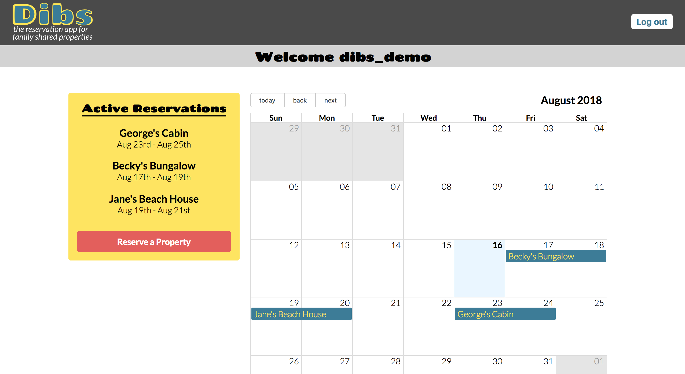
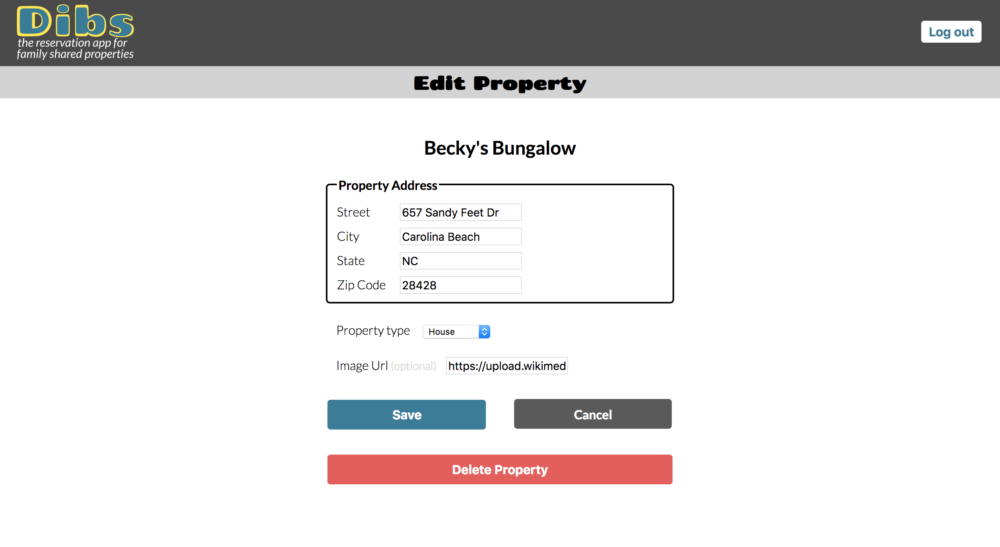

# Dibs

A fullstack javascript application that helps families manage secondary properties that they wish to share with other other family members. Users can share and reserve properties as well as see monthly availabities of each. Supports basic CRUD operations. Users can: 

* Create - Add properties and reservations
* Read   - Get a list of all properties and reservations 
* Update - Update property info
* Delete - Delete properties and reservations

## Demo

- [Live Demo](https://dibs-app.herokuapp.com/)

## Motivation

Being part of a large family that continues to grow with each new generation, it was becoming increasingly more challenging to share and make the most of secondary properties / vacation homes without stepping on one anothers toes. What was needed was a central system for listing properties to make them available for family members to reserve. 

## Built With
*The client and API were deployed separately and stored in separate GitHub repos.* 
- [Dibs API Repo](https://github.com/mike-crane/dibs-server)

### Front End
* HTML
* CSS
* JavaScript [ES6]
* React

### Back End
* Node.js
* Express
* Mongo
* Mongoose
* JWT Authentication
* bcryptjs
* Passport
* Mocha
* Chai

### DevOps
* Heroku
* TravisCI
* mLab

## Screenshots

Landing:

Registration:

Dashboard:

Reservations:

Add Property:

Edit Property:

## Using the API

### Authentication / Login
##### POST &nbsp;&nbsp;&nbsp;&nbsp;&nbsp;&nbsp; /api/auth/login

* Bearer Authentication with JSON Web Token
* Must supply valid Username and Password in request header
* If authentication succeeds, a valid 7d expiry JWT will be provided in response body

### Register New User
##### POST &nbsp;&nbsp;&nbsp;&nbsp;&nbsp;&nbsp; /api/users 

* Must supply First name, Last name, Username and Password in request body
* If successful, a valid 7d expiry JWT will be provided in response body

### Get All Properties
##### GET &nbsp;&nbsp;&nbsp;&nbsp;&nbsp;&nbsp; /api/dibs/properties

* This endpoint retrieves all properties from user database
* Must supply valid JWT via Bearer Authentication
* If authentication succeeds, all properties will be returned

### Get All Reservations
##### GET &nbsp;&nbsp;&nbsp;&nbsp;&nbsp;&nbsp; /api/dibs/reservations

* This endpoint retrieves all reservations from user database
* Must supply valid JWT via Bearer Authentication
* If authentication succeeds, all reservations will be returned

### Get Reservation by User
##### GET &nbsp;&nbsp;&nbsp;&nbsp;&nbsp;&nbsp; /api/dibs/reservations/{USER-GOES-HERE}

* This endpoint retrieves all users reservations from user database
* Must supply valid JWT via Bearer Authentication
* If authentication succeeds, all User reservations will be returned

### Add Property
##### POST &nbsp;&nbsp;&nbsp;&nbsp;&nbsp;&nbsp;/api/dibs/properties

* This endpoint adds a single property to user database
* Supply property object in request body
* Must supply valid JWT via Bearer Authentication

### Add Reservation
##### POST &nbsp;&nbsp;&nbsp;&nbsp;&nbsp;&nbsp;/api/dibs/reservations

* This endpoint adds a single reservation to user database
* Supply reservation object in request body
* Must supply valid JWT via Bearer Authentication

### Update Property
##### PUT &nbsp;&nbsp;&nbsp;&nbsp;&nbsp;&nbsp;/api/dibs/properties/{PROPERTY-ID-GOES-HERE}

* This endpoint updates a single property in user database
* Supply property ID as route parameter
* Supply property object in request body
* Must supply valid JWT via Bearer Authentication

### Delete Property
##### DELETE &nbsp;&nbsp;&nbsp;&nbsp;&nbsp;&nbsp;/api/dibs/properties/{PROPERTY-ID-GOES-HERE}

* This endpoint deletes a single property from user database
* Supply property ID as route parameter
* Must supply valid JWT via Bearer Authentication

### Delete Reservation
##### DELETE &nbsp;&nbsp;&nbsp;&nbsp;&nbsp;&nbsp;/api/dibs/reservations/{RESERVATION-ID-GOES-HERE}

* This endpoint deletes a single reservation from user database
* Supply reservation ID as route parameter
* Must supply valid JWT via Bearer Authentication